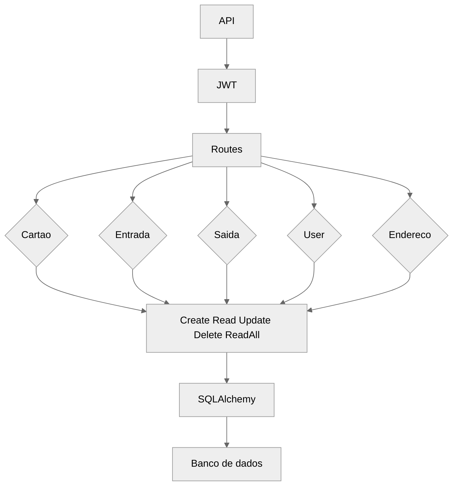

# API do projeto

- API Desenvolvida para conexão e autenticação de usuarios com uso de JWT

# Pacotes utilizados
- FastAPI 
- pydantic (criaçåo de dataclasses)
- SQLAlchemy (ORM)
- jwt (autenticação de Login)



```mermaid
mindmap
  root((saldo))
    Diminuiu o Valor
        Valor{{valor < saldo?}}
            Notifica)Saldo no vermelho(

            Valor{{Valor próximo de 0?}}
                Notifica)Saldo proximo do limite(
        
        Despesas
            Valor{{Proximo do fim do mes e com despesas a pagar}}
                Notifica)Necessario pagar contas ˜Saldo pode cobrir x de despesas˜(

    
    Contas a pagar
        Vencimento{{Falta 5 dias para vencer?}}
            Notifica)Esta chegando o vencimento da conta X(
        
        Conta{{Paga?}}
            Notifica)Conta paga com sucesso!(
        
        Saldo{{Saldo pode pagar a conta e falta 3 dias para pagar?}}
            Notifica =)Conta X já pode ser paga com o saldo atual(

    Limite do Cartao
        Limite{{Limite próximo de 0 "5% do valor total" }}
            Notifica)Saldo do cartao X esta próximo do fim(
        Limite{{Chegou a 0}}
            Notifica)Você não possui mais limite no cartao X(

    
    Aumentou o valor
        Valor{{Acima do mes anterior?}}
            Notifica)Saldo passou do mes anterior(
        
        Valor{{Proximo do mes anterior}}
            Notifica)Saldo proximo de alcançar o mes anterior(
        
    
